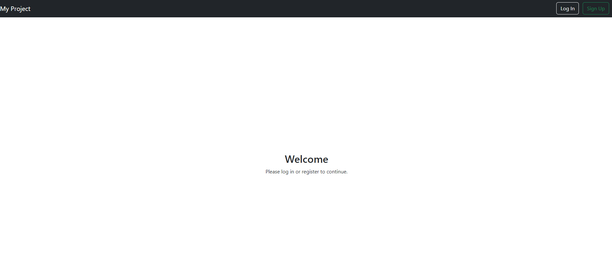
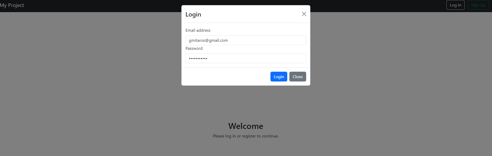
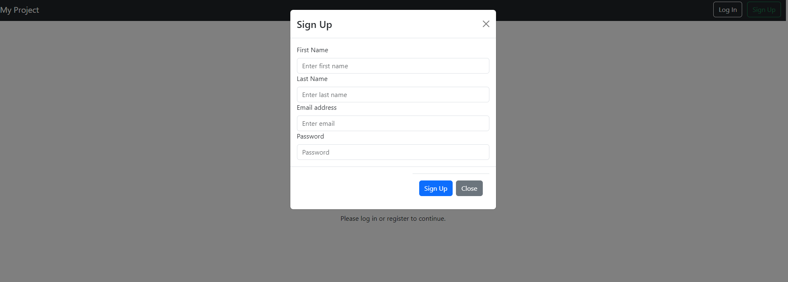
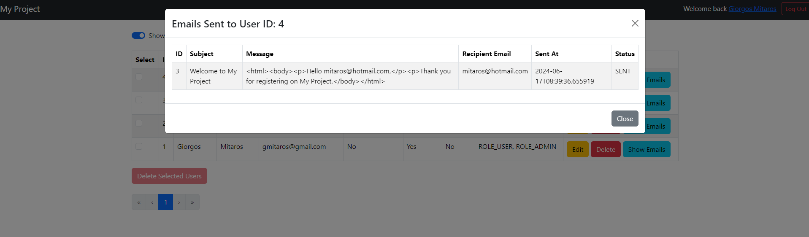
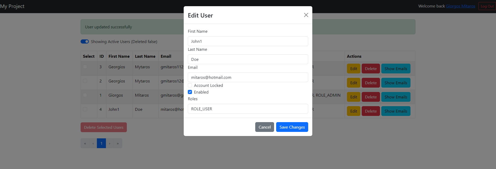

# My Project

## Prerequisites

Make sure you have the following installed on your machine:

- Java 21
- Maven (v3.9.7)
- Docker (tested with version 4.31.1)
- Docker Compose
- Node.js (tested with version v20.12.2) and npm (tested with version v10.5.0)

## Getting Started

### Step 1: Build the Maven Projects

First, navigate to the root directory of your project and run the following command to clean and build all Maven projects:

```sh
mvn clean install
```

### Step 2: Build and Run Docker Compose

After building the Maven projects, build and run the Docker Compose setup:

```sh
docker-compose build
docker-compose up
```

This will start all the services defined in your `docker-compose.yml` file, including the MailHog SMTP server.

### Step 3: Set Up the Frontend

Navigate to the `frontend` folder, install the necessary npm packages, and start the frontend server:

```sh
cd frontend
npm install
npm run start
```

### Access the Application

Once everything is up and running, you can access the application in your browser at:

[http://localhost:3000](http://localhost:3000)

You can also access the MailHog interface to view sent emails at:

[http://localhost:8025](http://localhost:8025)

## Project Structure

### Overview

The project is structured into several microservices, each serving a specific purpose. Here's an analytical explanation of each service:

- **auth-server**:
    - **Purpose**: This service handles the authentication of users.
    - **Functionalities**: It supports user login, registration, token generation, and validation. It leverages OAuth2 and JWT for secure authentication processes.

- **authentication-core**:
    - **Purpose**: This is a shared module that provides core authentication functionalities.
    - **Functionalities**: It includes common authentication logic, utilities, and configurations that are used by other services, ensuring consistency and reducing code duplication.

- **discovery-service**:
    - **Purpose**: This service is responsible for service discovery in a microservices architecture.
    - **Functionalities**: It uses Netflix Eureka to allow microservices to register themselves at runtime and discover other registered services. This enables dynamic scaling and flexibility in the network configuration.

- **email-service**:
    - **Purpose**: This service manages the sending of emails within the application.
    - **Functionalities**: It handles email templates, SMTP configurations, and integrates with the MailHog SMTP server for email testing. It ensures that all email-related operations are centralized.

- **gateway-service**:
    - **Purpose**: This is the API gateway for the application.
    - **Functionalities**: It acts as a reverse proxy to route requests from clients to the appropriate microservices. It also provides functionalities such as load balancing, request filtering, and security (e.g., rate limiting, authentication).

- **frontend**:
    - **Purpose**: This is the client-facing part of the application.
    - **Functionalities**: It is a web application built with  React that interacts with the backend services via APIs. It provides a user interface for users to interact with the application.
    - **More info**: Click [Frontend README](frontend/README.md) to view more info

# Benefits of the Architectural Design

## 1. **Separation of Concerns**
- Each microservice is responsible for a specific aspect of the application, leading to a clear separation of concerns. This modular approach makes it easier to understand, develop, and maintain each part of the system.

## 2. **Scalability**
- Microservices can be scaled independently based on their load and resource requirements. For instance, the `auth-server` can be scaled up during peak login times without affecting other services like the `email-service`.

## 3. **Flexibility and Technology Diversity**
- Different microservices can be developed using different technologies and frameworks best suited for their specific tasks. This flexibility allows the use of the best tool for each job.

## 4. **Improved Fault Isolation**
- If one microservice fails, it does not necessarily bring down the entire system. For example, if the `email-service` encounters an issue, the rest of the application (e.g., user authentication and frontend) can continue to function.

## 5. **Ease of Deployment**
- Microservices enable continuous deployment and delivery. Services can be deployed independently, which reduces the risk of deployment failures and allows for faster iteration and release cycles.

## 6. **Enhanced Maintainability and Testability**
- Smaller codebases are easier to manage and test. Each microservice can be tested in isolation, leading to more effective and efficient testing processes.

## 7. **Service Reusability**
- Common functionalities (like those in `authentication-core`) can be reused across multiple services, promoting code reuse and reducing duplication.

## 8. **Dynamic Discovery and Load Balancing**
- The `discovery-service` allows for dynamic service discovery and registration, which simplifies the management of microservice instances and enables effective load balancing and failover strategies.

## 9. **Centralized API Management**
- The `gateway-service` provides a single entry point for clients, centralizing API management. It handles routing, security, and load balancing, which simplifies client interactions with the backend services.

## 10. **Centralized Configuration and Management**
- Configuration management for microservices can be centralized, making it easier to manage configurations across different environments and ensuring consistency.

By adopting this microservices architecture, the project benefits from improved modularity, scalability, flexibility, fault isolation, and maintainability, making it well-suited to handle the complexities and demands of modern application development.
## Additional Information

- **MailHog**: A fake SMTP server to capture and view emails. It can be accessed at [http://localhost:8025](http://localhost:8025).
- **Flyway**: All database schemas are auto-migrated using Flyway.
- **Swagger**: API documentation can be accessed from Swagger at the following URLs:
    - Authentication Service: [http://localhost:8080/auth/swagger-ui/index.html](http://localhost:8080/auth/swagger-ui/index.html)
    - Email Service: [http://localhost:8080/emails/swagger-ui/index.html#/](http://localhost:8080/emails/swagger-ui/index.html#)


## Images







## Troubleshooting

If you encounter any issues, make sure:

- All services are up and running.
- Ports 1025 and 8025 (for MailHog) are not blocked by your firewall.
- You have the correct versions of Java, Maven, Docker, and Node.js installed.