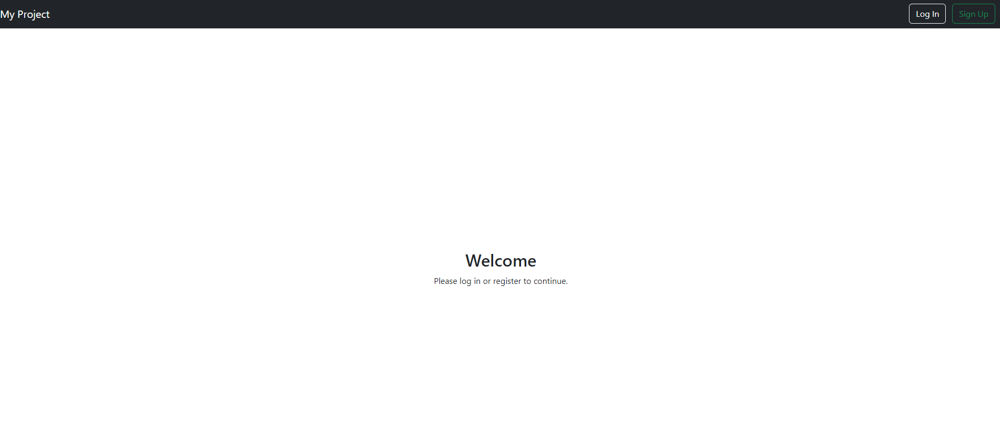
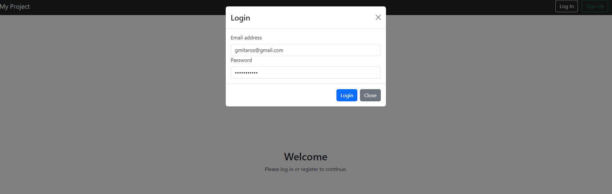
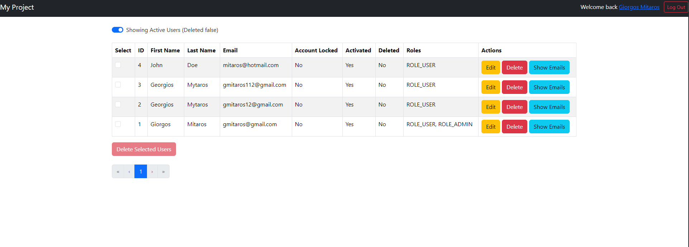
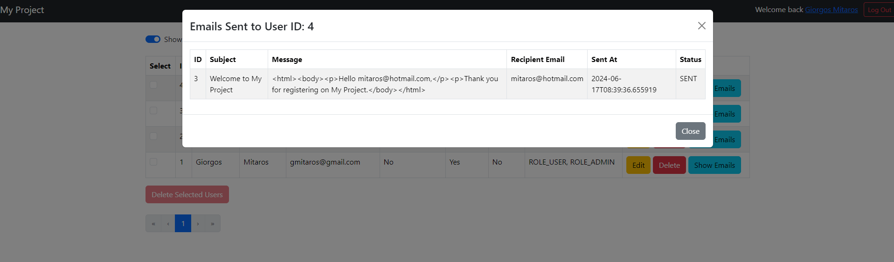
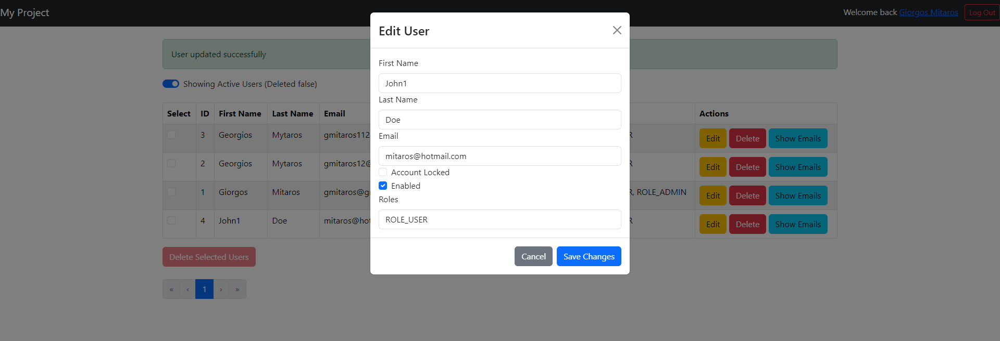

# myproject Frontend

This project is a User Management System built with React, Tailwind CSS, and React Bootstrap. It features user data retrieval from an API, displaying the user information in a paginated table with options to edit and delete each user.

## Features

- **Fetch User Data**: Retrieve user information from an API and display it in a structured table format.
- **Pagination**: Navigate through pages of user data seamlessly.
- **Edit User**: Modify user details with an edit functionality.
- **Delete User**: Remove users from the system with a delete functionality.

## Technologies Used

- **React**: A JavaScript library for building user interfaces.
- **Tailwind CSS**: A utility-first CSS framework for rapidly building custom user interfaces.
- **React Bootstrap**: A popular library for integrating Bootstrap components with React.
- **Axios**: A promise-based HTTP client for making API requests.

## Local Development

### Prerequisites

- Node.js installed on your machine

```shell
PS E:\my-projects\spring-boot-user-management> node -v
v20.12.2
PS E:\my-projects\spring-boot-user-management> npm -v
10.5.0
```

### Running Locally

1. Clone the repository:

    ```bash
    git clone https://github.com/gmitaros/spring-boot-user-management.git
    ```

2. Navigate to the project directory:

    ```bash
    cd E:\my-projects\spring-boot-user-management
    cd .\frontend\
    ```

3. Install dependencies:

    ```bash
    npm install
    ```

4. Create a `.env` file in the root directory and add the following environment variables:
   #### Localhost
   ```
   REACT_APP_HOST=http://localhost:8080
    ```

5. Start the development server:

    ```bash
    npm run start
    ```

6. Open [http://localhost:3000](http://localhost:3000) in your browser to view the application.

The page will reload when you make changes.\
You may also see any lint errors in the console.
Ensure your API server is running and accessible at this address.

# React Components and Their Usages

## 1. App Component
- **Purpose**: The `App` component serves as the root component of your application.
- **Usage**: It handles authentication by managing the user's token and user information, checking token validity, and storing the token in local storage. The `App` component also defines the main routes of your application, including the login, registration, account activation, user list, and user detail pages.

## 2. Header Component
- **Purpose**: The `Header` component is used to display the header of your application.
- **Usage**: It likely includes navigation links and displays information about the logged-in user. It also provides a login function to handle user authentication.

## 3. UserList Component
- **Purpose**: The `UserList` component displays a list of users.
- **Usage**: It fetches users from the server and displays them in a table format. It includes functionalities to edit user details, delete users, and view emails sent to users. It conditionally renders certain actions based on the user's role, ensuring only admins can perform specific actions.

## 4. EditUserModal Component
- **Purpose**: The `EditUserModal` component provides a modal dialog for editing user details.
- **Usage**: It is used within the `UserList` component to allow admins to update user information. The modal includes a form for editing user details and handles saving changes via an API call.

## 5. EmailsModal Component
- **Purpose**: The `EmailsModal` component displays emails sent to a specific user.
- **Usage**: It is used within the `UserList` component to show a list of emails associated with a user. The modal fetches email data from the server and displays it in a table format.

## 6. Welcome Component
- **Purpose**: The `Welcome` component prompts the user to log in or register.
- **Usage**: It is displayed when an unauthenticated user attempts to access parts of the application that require authentication. It provides buttons to navigate to the login or registration pages.

## 7. UserDetailPage Component
- **Purpose**: The `UserDetailPage` component displays detailed information about a specific user.
- **Usage**: It fetches and displays a user's details based on the user ID from the URL parameters. The information is shown in a readable format, including user roles, account status, and personal details.

## Overall Usage in Application

Your application is structured to handle user management efficiently:
- **Authentication**: The `App` component manages authentication, ensuring secure access to the user list and details.
- **User Management**: The `UserList` component, along with the `EditUserModal` and `EmailsModal`, allows for comprehensive user management, including viewing, editing, and deleting users, as well as viewing associated emails.
- **Detail View**: The `UserDetailPage` provides a detailed view of individual user information, enhancing the ability to manage and view user-specific data.
- **Navigation and User Interaction**: The `Header` and `Welcome` components facilitate easy navigation and user interaction, guiding users through authentication and registration processes.









## Available Scripts

In the project directory, you can run:

### `npm start`

Runs the app in the development mode.\
Open [http://localhost:3000](http://localhost:3000) to view it in your browser.

The page will reload when you make changes.\
You may also see any lint errors in the console.

### `npm test`

Launches the test runner in the interactive watch mode.\
See the section about [running tests](https://facebook.github.io/create-react-app/docs/running-tests) for more
information.

### `npm run build`

Builds the app for production to the `build` folder.\
It correctly bundles React in production mode and optimizes the build for the best performance.

The build is minified and the filenames include the hashes.\
Your app is ready to be deployed!

See the section about [deployment](https://facebook.github.io/create-react-app/docs/deployment) for more information.

### Deployment

This section has moved
here: [https://facebook.github.io/create-react-app/docs/deployment](https://facebook.github.io/create-react-app/docs/deployment)
